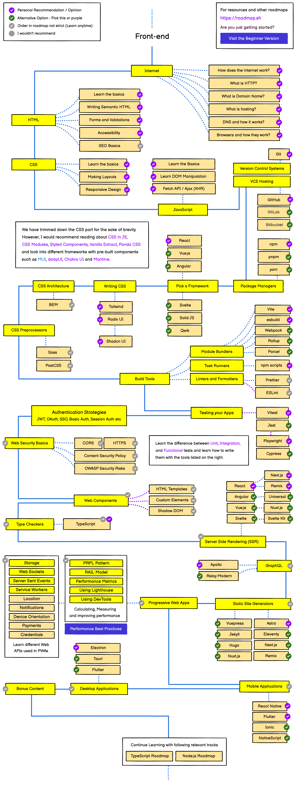

# 😎 Guia do Frontend 

Bem-vindo ao Guia do Frontend! Este repositório é o ponto de partida perfeito para quem quer mergulhar no universo do desenvolvimento frontend. Aqui, você encontrará uma série de arquivos recheados de conceitos, exemplos práticos e links úteis para o desenvolvimento.

## 🗺️ Roadmap

Gosto muito do site [roadmap.sh](https://roadmap.sh/), pois nele é possível encontrar trilhas e recursos valiosos para o aprendizado de diferentes áreas da TI.  Como pode ser visualizado na figura a seguir a trilha de front end deles abrange desde os fundamentos da Web, como HTML, CSS e JavaScript, até frameworks populares, como React, Vue e Angular. 

Não se sinta pressionado a seguir cada passo desta trilha rigidamente. O desenvolvimento frontend é uma jornada pessoal, e você pode adaptar seu percurso de acordo com seus interesses, necessidades e objetivos. Use este roadmap como uma bússola, mas sinta-se à vontade para explorar caminhos que despertem mais sua curiosidade.

## 📚 Conteúdo:

### 1. Fundamentos da Web:

- [Request Headers](./Fundamentos%20da%20Web/Requisições/Request%20Headers.md)
- [Request Methods](./Fundamentos%20da%20Web/Requisições/Request%20Methods.md)
- [Response Headers](./Fundamentos%20da%20Web/Respostas/Response-Headers.md)
- [Status Code](./Fundamentos%20da%20Web/Respostas/Status-Code.md)

#### Referências: 
- [Protocolo HTTP: Mdn Web Docs](https://developer.mozilla.org/pt-BR/docs/Web/HTTP)

### 2. HTML

- [Estrutura Básica](./HTML/Estrutura%20Básica.md)
- [Tags Básicas](./HTML/Tags%20Básicas.md)
- [Seções](./HTML/Seções.md)
- [Nomenclatura](./HTML/Nomenclatura.md)
- [Cabeçalhos](./HTML/Cabeçalhos.md)
- [Texto](./HTML/Texto.md)
- [Formulário](./HTML/Formulário.md)
- [Listas](./HTML/Listas.md)
- [Tabelas](./HTML//Tabelas.md)
- [Links](./HTML/Links.md)
- [Meta Tags](./HTML/Meta%20Tags.md)
- [SEO](./HTML/SEO.md)
- [Sitemap XML](./HTML/Sitemap%20XML.md)
- [robots.txt](./HTML/robots.txt.md)
- [Google Hacking](./HTML/Google%20Hacking.md)
- [SEO Poisoning](./HTML/SEO%20Poisoning.md)
- [Black Hat SEO](./HTML/Black%20Hat%20SEO.md)
- [Acessibilidade](./HTML/Acessibilidade.md)
- [ARIA](./HTML/ARIA.md)
- [Internacionalização](./HTML/Internacionalização.md)
- [HTML Injection](./HTML/HTML%20Injection.md)

#### Referências:

- [HTML: Mdn Web Docs](https://developer.mozilla.org/pt-BR/docs/Learn/HTML)
- [Learn HTML: W3Schools](https://www.w3schools.com/html/default.asp)
- [HTML References: W3Schools](https://www.w3schools.com/tags/default.asp)
- [HTML: Tutorials Point](https://www.tutorialspoint.com/html/index.htm)

### 3. CSS

- [Estrutura Básica](./CSS/Estrutura%20Básica.md)
- [Reset CSS](./CSS/Reset%20CSS.md)
- [Organização](./CSS/Organização.md)
- [Cores](./CSS/Cores.md)
- [Fontes](./CSS/Fontes.md)
- [Texto](./CSS/Texto.md)
- [Background](./CSS/Background.md)
- [Imagens](./CSS/Imagens.md)
- [Unidades de Medida](./CSS/Unidades%20de%20Medida.md)
- [Modelo de Caixa](./CSS/Modelo%20de%20Caixa.md)
- [Bordas](./CSS/Bordas.md)
- [Dimensionamento](./CSS/Dimensionamento.md)
- [Display](./CSS/Display.md)
- [Flexbox](./CSS/Flexbox.md)
- [Grid Layout](./CSS/Grid%20Layout.md)
- [Posição](./CSS/Posição.md)
- [Media Query](./CSS/Media%20Query.md)
- [Responsividade](./CSS/Responsividade.md)
- [Pseudo Classes](./CSS/Pseudo%20Classes.md)
- [Variáveis](./CSS/Variáveis.md)
- [Trasnformações 2D](./CSS/Transformações%202D.md)
- [Transformações 3D](./CSS/Transformações%203D.md)
- [Animações](./CSS/Animações.md)
- [Sombras](./CSS/Sombras.md)
- [CSS Injection](./CSS/CSS%20Injection.md)

#### Referências:

- [CSS: Mdn Web Docs](https://developer.mozilla.org/pt-BR/docs/Learn/CSS)
- [Learn CSS: W3Schools](https://www.w3schools.com/css/default.asp)
- [CSS References: W3Schools](https://www.w3schools.com/cssref/index.php)
- [CSS: Tutorials Point](https://www.tutorialspoint.com/css/index.htm)

### 4. SAAS

- [Introdução](./SAAS/Introdução.md)
- [Variáveis](./SAAS/Variáveis.md)
- [Aninhamento](./SAAS/Aninhamento.md)
- [Importações](./SAAS/Importações.md)
- [Mixin](./SAAS/Mixin.md)
- [Extend](./SAAS/Extend.md)

#### Referências:

- [SASS: W3Schools](https://www.w3schools.com/sass/default.php)
- [SASS: Tutorials Point](https://www.tutorialspoint.com/sass/index.htm)

### 5. Javascript

- [Variáveis](./Javascript/Variáveies%20e%20Operadores.md)
- [Conversões para Boolean](./Javascript/Conversões%20para%20Boolean.md)
- [Estruturas Condicionais](./Javascript/Estruturas%20Condicionais.md)
- [Arrays](./Javascript/Array.md)
- [Maps](./Javascript/Maps.md)
- [Sets](./Javascript/Sets.md)
- [Estruturas de Repetições](./Javascript/Estruturas%20de%20Repetição.md)
- [Funções](./Javascript/Funções.md)
- [Escopo](./Javascript/Escopo.md)
- [Objetos](./Javascript/Objetos.md)
- [Orientação ao Protótipo](./Javascript/Orientação%20ao%20Protótipo.md)
- [Classes](./Javascript/Classes.md)
- [Destructuring](./Javascript/Destructuring.md)
- [Null e Undefined](./Javascript/Null%20e%20Undefined.md)
- [Json](./Javascript/Json.md)
- [Importação e Exportação](./Javascript/Importando%20e%20Exportando.md)
- [Importações Dinâmicas](./Javascript/Importações%20Dinâmicas.md)
- [Tratamento de Erros](./Javascript/Tratamento%20de%20Erros.md)
- [Captura de Erros não Tratados](./Javascript/Captura%20de%20Erros%20Não%20Tratados.md)
- [Promises](./Javascript/Promise.md)
- [Funções Assíncronas](./Javascript/Funções%20Assíncronas.md)
- [Fetch](./Javascript/Fetch.md)
- [Axios](./Javascript/Axios.md)
- [Modo Estrito](./Javascript/Modo%20Estrito.md)
- [Browser Object Model](./Javascript/Browser%20Object%20Model.md)
- [WebStorage](./Javascript/Webstorage.md)
- [Cookies](./Javascript/Cookies.md)
- [Métodos do DOM](./Javascript/Métodos%20do%20DOM.md)
- [Formulários](./Javascript/Formulários.md)
- [Eventos](./Javascript/Eventos.md)

#### Jest

- [Testes com Jest](./Jest/Testes.md)
- [Matchers](./Jest/Matchers.md)
- [Organização dos Testes](./Jest/Organização%20dos%20Testes.md)
- [Mocks](./Jest/Mocks.md)

#### Referências:

- [Javascript: Mdn Web Docs](https://developer.mozilla.org/pt-BR/docs/Web/JavaScript)
- [Learn Javascript: W3Schools](https://www.w3schools.com/js/default.asp)
- [Javascript Reference: W3Schools](https://www.w3schools.com/jsref/default.asp)
- [Javascript: Tutorials Point](https://www.tutorialspoint.com/javascript/index.htm)

### 6. Typescript

- [Introdução](./Typescript/Introdução.md)
- [Variáveis](./Typescript/Variáveis.md)
- [Type Assertions](./Typescript/Type%20Assertion.md)
- [Funções](./Typescript/Funções.md)
- [Generics](./Typescript/Generics.md)
- [Tipos de Funções](./Typescript/Tipos%20de%20Funções.md)
- [Classes](./Typescript/Classes.md)
- [Interfaces](./Typescript/Interfaces.md)
- [Tipos Literais](./Typescript/Tipos%20Literais.md)
- [Enums](./Typescript/Enums.md)
- [Polimorfismo Estrutural](./Typescript/Polimorfismo%20Estrutural.md)
- [Typescript Compiler](./Typescript/Typescript%20Compiler.md)

#### Referências:

- [Typescript: W3Schools](https://www.w3schools.com/typescript/index.php)
- [Typescript: Tutorials Point](https://www.tutorialspoint.com/typescript/index.htm)

### 7. React:

- [Inicializando Projetos com o CRA](./React/CRA.md)
- [Inicializando Projetos com o Vite](./React/Vite.md)
- [Componentes](./React/Componentes.md)
- [Renderização](./React/Renderização.md)
- [JSX](./React/JSX.md)
- [Renderização Condicional](./React/Renderização%20Condicional.md)
- [Eventos](./React/Eventos.md)
- [Formulários](./React/Formulários.md)
- [Formulários Controlados vs Não Controlados](./React/Formulários%20Controlados%20vs%20Não%20Controlados.md)
- [Formulários Controlados](./React/Formulários%20Controlados.md)
- [Formulários Não Controlados](./React/Formulários%20Não%20Controlados.md)
- [Contextos](./React/Contextos.md)
- [React Router](./React/React%20Router.md)
- [Rotas Protegidas](./React/Rotas%20Protegidas.md)
- [Estilização](./React/Estilização.md)
- [Styled Components](./React/Styled-Components.md)
- [Themes e Tokens](./React/Themes%20e%20Tokes.md)

#### Hooks:

- [useState](./React/useState.md)
- [useEffect](./React/useEffect.md)
- [useRef](./React/useRef.md)
- [useReducer](./React/useReducer.md)
- [useCallback](./React/useCallback.md)
- [Hooks Personalizados](./React/Hooks%20Personalizados.md)
- [React Hook Form](./React/React%20Hook%20Forms.md)
- [Zustand](./React/Zustand.md)

#### React Testing Library:

- [Configuração do Jest e React Testing Library com Vite](./React%20Testing%20Library/Configuração%20do%20Jest%20e%20React%20Testing%20Library%20com%20Vite.md)
- [Testes de Componentes](./React%20Testing%20Library/Testes%20de%20Componentes.md)
- [Seletores e Consulta de Elementos](./React%20Testing%20Library/Seletores%20e%20Consulta%20de%20Elementos.md)
- [Testes de Interações do Usuário](./React%20Testing%20Library/Testes%20de%20Interações%20do%20Usuário.md)

#### Referências:

- [React: W3Schools](https://www.w3schools.com/react/default.asp)
- [ReactJS: Tutorials Point](https://www.tutorialspoint.com/reactjs/index.htm)

## 🌐 Recursos Adicionais

- [Full Stack Open](https://fullstackopen.com/en/)
- [React Typescript Cheatsheets](https://react-typescript-cheatsheet.netlify.app/)

## 🤝 Contribua!

Este guia está em constante crescimento, e sua contribuição é mais do que bem-vinda! Se você tem dicas, exemplos adicionais ou quer corrigir algo, sinta-se à vontade para abrir uma issue ou enviar um pull request. Vamos tornar este guia ainda mais incrível!

Divirta-se codificando! 🚀✨